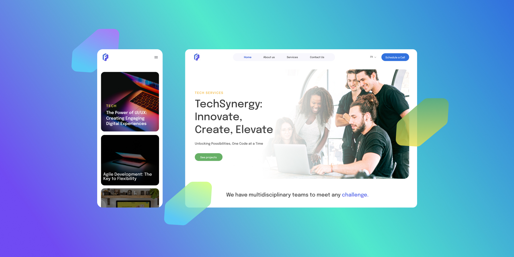

# 🧩 Nershore.io


---

## 📖 Описание проекта

**Nershore.io** — учебный проект, созданный для **тренировки навыков HTML / CSS / JavaScript верстки** на основе дизайн-макета из Figma.

Основной упор сделан на:
- чистую и семантическую разметку
- модульную структуру CSS
- адаптивность
- аккуратное соответствие дизайн-макету

Проект не является коммерческим и используется в образовательных целях.

---

## 🎨 Макет

- **Figma:** https://clck.ru/3QqMHF
- **Ссылка на готовый проект:** https://nershore-io.vercel.app/

> Макет использовался как основной источник дизайна: сетка, отступы, шрифты и цветовая палитра соблюдены максимально точно.

---

## 🛠 Используемые технологии

<!-- TECHNOLOGY ICONS -->
<p align="left">
  
  
  
  
  
</p>

### Стек:
- **HTML5** — семантическая и доступная разметка
- **CSS3** — Flexbox, Grid, CSS Variables, модульные файлы
- **JavaScript (ES6+)** — интерактивность, логика интерфейса
- **Swiper.js** — слайдеры и карусели
- **Git / GitHub** — контроль версий

---

## ✨ Особенности и фишки проекта

- 📱 **Адаптивная верстка** (desktop / tablet / mobile)
- 🧱 **BEM-нейминг** и логичная структура CSS
- 🎯 Максимальное соответствие дизайн-макету
- 🧩 Разделение CSS по секциям сайта
- ⚡ Подключение кастомных шрифтов (woff2)
- 📦 Отдельные скрипты для каждого слайдера
- 🍔 Бургер-меню и языковая кнопка

---

## 📂 Структура проекта

```text
Nershore.io/
│── css/
│   ├── style.css
│── fonts/
│── icons/
│── image/
│── scripts/
│   ├── index.js
│── index.html
│── README.md
```

## 🚀 Как запустить проект

### Способ 1: Обычный запуск

1. Склонировать репозиторий:
```bash
   git clone https://github.com/ruin9r/Nershore.io.git
```

2. Перейти в папку проекта:
```bash
   cd Nershore.io
```

3. Открыть файл `index.html` в браузере

### Способ 2: Через Live Server (рекомендуется)

1. Установить расширение Live Server в VS Code
2. Открыть проект в редакторе
3. Нажать правой кнопкой по `index.html` → **Open with Live Server**
